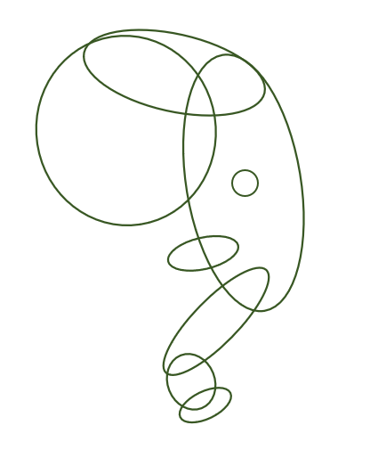

.. tusc documentation master file, created by
   sphinx-quickstart on Wed Dec 29 12:28:31 2021.
   You can adapt this file completely to your liking, but it should at least
   contain the root `toctree` directive.

Welcome to tusc's documentation!
================================

**tusc** is a WIP Python library providing tools for combinatorial maths.

The code can be found on GitHub_.

Table of Contents
=================

.. toctree::
   :maxdepth: 7

   apiref

* :ref:`genindex`

.. _GitHub: https://github.com/lucasmccabe/tusc
